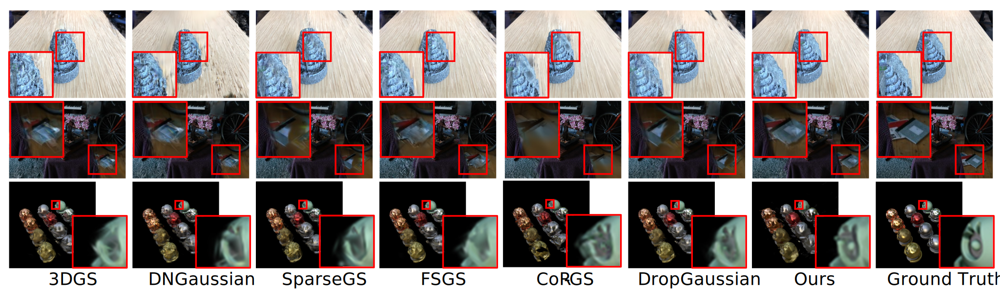

# 💡 Shape-Selective Splatting: Regularizing the Shape of Gaussian for Sparse-View Rendering

This repository provides the official PyTorch implementation of the paper:  
**[Shape-Selective Splatting: Regularizing the Shape of Gaussian for Sparse-View Rendering](https://ieeexplore.ieee.org/document/11119067?source=authoralert)**

by **Gun Ryu** and **Wonjun Kim (Corresponding Author)**  

📄 *IEEE Signal Processing Letters (SPL), 2025*

---

## 📦 Installation

### 🛠 Environment Setup

Install the required dependencies via conda:

```bash
conda env create -f environment.yml
conda activate sss
```


### 🗂️ Dataset preparation
In the data preparation stage, we first reconstruct sparse-view inputs using **Structure-from-Motion (SfM)** with the provided camera poses from the datasets. Then, we perform dense stereo matching using COLMAP’s `patch_match_stereo` function, followed by `stereo_fusion` to generate the dense stereo point cloud.

<details>
<summary><strong> Setup Instructions</strong></summary>

```bash
mkdir dataset
cd dataset

# Download LLFF dataset
gdown 16VnMcF1KJYxN9QId6TClMsZRahHNMW5g

# Generate sparse point cloud using COLMAP (limited views) for LLFF
python tools/colmap_llff.py

# Download MipNeRF-360 dataset
wget http://storage.googleapis.com/gresearch/refraw360/360_v2.zip
unzip -d mipnerf360 360_v2.zip

# Generate sparse point cloud using COLMAP (limited views) for MipNeRF-360
python tools/colmap_360.py
```

We also provide preprocessed sparse and dense point clouds for convenience.
You can download them via the link below:

👉 [Download Preprocessed Point Clouds](https://drive.google.com/drive/folders/1P3I9m_HU0jF50qwxIIhXhegOVk-kihdI?usp=sharing)
</details>

Furthermore, we estimate monocular depth using the method described in [Fine-Tuning Image-Conditional Diffusion Models](https://github.com/VisualComputingInstitute/diffusion-e2e-ft).
Please ensure that the resulting depth `.npy` files are saved in the `depth_npy_{resolution}/` directory of the dataset. These files **must** be located in the same directory as the original images, and their filenames should match the original image filenames, with the suffix **`_pred.npy`** appended.

<details>
<summary><strong>Example layout for “fern” scene (8× downsampled)</strong></summary>

```bash
fern/
├── images/
│   ├ IMG_4043.JPG
│   ├ IMG_4044.JPG
│   ├ IMG_4045.JPG
│   └ … other `.JPG` files
├── sparse/
├── dense/
└── depth_npy_8/
    ├ IMG_4043_pred.npy
    ├ IMG_4044_pred.npy
    ├ IMG_4045_pred.npy
    └ … other `{image_name}_pred.npy` files
```

</details>

---

## 🏋️‍♂️ Training

### 🖼️ LLFF Dataset

To train on a single LLFF scene, use the following command:

```bash
python train.py -s ${DATASET_PATH} -m ${OUTPUT_PATH} --eval -r 8 --n_views {3 or 6 or 9}
```

### 🖼️ MipNeRF-360 Dataset

To train on a single MipNeRF-360 scene, use the following command:

```bash
python train.py -s ${DATASET_PATH} -m ${OUTPUT_PATH} --eval -r 8 --n_views {12 or 24}
```

---

## 🎥 Rendering

You can render a target scene using the following command:

### 🖼️ LLFF Dataset

```bash
python render.py -s ${DATASET_PATH} -m ${MODEL_PATH} --eval -r 8 --iteration 10000
```

### 🖼️ MipNeRF-360 Dataset

```bash
python render.py -s ${DATASET_PATH} -m ${MODEL_PATH} --eval -r 8 --iteration 10000
```

---

## 📊 Evaluation

You can evaluate the model performance using the following command:

### 🖼️ LLFF Dataset

```bash
python metrics.py --model_paths ${MODEL_PATH}
```

### 🖼️ MipNeRF-360 Dataset

```bash
python metrics.py --model_paths ${MODEL_PATH}
```
---
## 🧪 Experimental Results

### ✨ Qualitative Results



---

## 📎 Citation

If you find this work helpful, please consider citing:

```bibtex
@ARTICLE{ryu2025sss,
  author={Ryu, Gun and Kim, Wonjun},
  journal={IEEE Signal Processing Letters}, 
  title={Shape-Selective Splatting: Regularizing the Shape of Gaussian for Sparse-View Rendering}, 
  volume={32},
  pages={3172-3176},
  doi={10.1109/LSP.2025.3596225}
}

```

---

## 📫 Contact

If you have any questions or issues, feel free to reach out:

- **Gun Ryu**: [fbrjs15@konkuk.ac.kr]  
